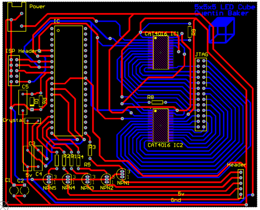

# LED-Cube
5x5x5 LED Cube Matrix that displays animations. The cube was designed, assembled, and programmed by me. Assembly Language was used to program the cube.

What I learned
* Learned the concept of Binary Code Modulation to adjust LED brightness.
* Learned the concept of LED Multiplexing.
* Increased code organization skills.
* Increased my knowledge on reusable functions.

Component List
* Atmega 32 Microcontroller
* Cat4016 LED Driver x2
* Blue LED x 125
* BC635 Transistor x5
* 16 Mghz Crystal x1
* 10k resistor
* 1k resistor x5
* 2.2k resistor x2
* 22pF capacitor x2
* 100pF capacitor x3
* 1N914 Diode
* Header Pins x43

Links  
[Video Demonstration](https://www.dropbox.com/s/5bddt0keatf781a/5x5x5LedCube.mp4?dl=0 "5x5x5 Led Cube")

Circuit Board Images  

